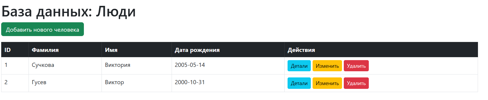
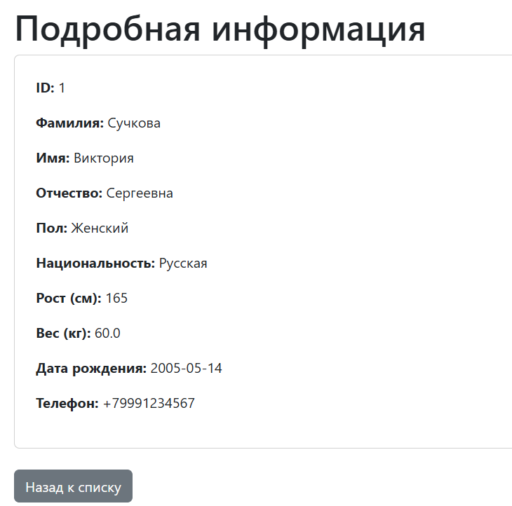
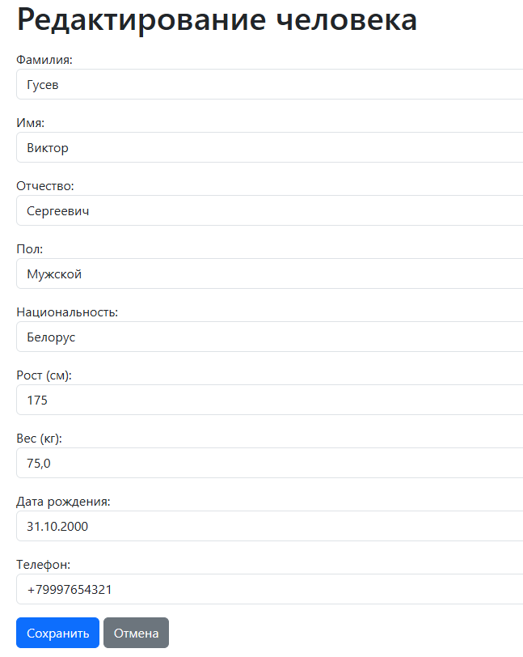

# Лабораторная работа 2. Репозиторий в Spring Data JPA

## Цель работы
Изучить способ использования репозитория в Spring Data JPA, реализовать приложение с функциями создания, редактирования, удаления и отображения сущности «Человек» (вариант 1) с использованием реляционной БД.

## Архитектура проекта
- **Стек:** Java 17, Spring Boot 3, Maven
- **СУБД:** H2 Database (In-Memory)
- **Основные слои:**
    - entity (Person.java) — доменный класс.
    - repository (PersonRepository.java) — интерфейс для доступа к БД, наследуемый от CrudRepository.
    - controller (PersonController.java) — обработка HTTP-запросов и маршрутизация.
    - resources/templates — представления на базе Thymeleaf.
- **Ключевые аннотации:**
    - @Entity, @Table, @Id, @GeneratedValue (JPA)
    - @Controller, @RequestMapping, @GetMapping, @PostMapping (Spring Web)
    - @PathVariable, @ModelAttribute (Привязка данных)
    - @Autowired (Внедрение зависимостей)

## Алгоритм работы
1. При запуске приложения Spring Boot инициализирует БД H2 в памяти на основе настроек из application.properties.
2. Если свойство defer-datasource-initialization=true включено, Hibernate генерирует схему таблиц из @Entity классов, после чего выполняется скрипт data.sql для заполнения начальными данными.
3. При переходе на эндпоинт /persons контроллер обращается к PersonRepository.findAll(), передает данные в Model и возвращает Thymeleaf шаблон main.html.
4. Для добавления/изменения пользователя используется PersonRepository.save(). Данные с формы (метод POST) маппятся в объект Person через @ModelAttribute.
5. При удалении или обновлении записи предварительно вызывается `PersonRepository.existsById() для проверки наличия сущности в базе данных, предотвращая ошибки.

## Скриншот работы приложения

Главная страница со списком:

Детальная страница пользователя:

Форма ввода данных (добавление/редактирование):
